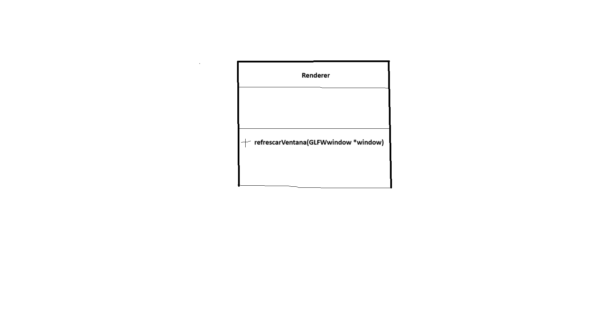

# pr1-PAG
El proyecto para la primera practica en PAG, donde vemos OpenGL y como crear una aplicación gráfica sencilla

Respecto a la cuestión propuesta a resolver, bastaría con hacer el método de la clase Renderer como estático, para que 
así pueda usarse como callback en la funcion glfwSetWindowRefreshCallback()

U otra solucion sería crear un espacio de nombres "PAG" en un archivo .h y en él crear la clase Renderer, y luego
crear un metodo en C el cual crea un objeto Renderer y este renderiza la pantalla. Este último método no debería dar ningún problema a la hora de usarlo como callback