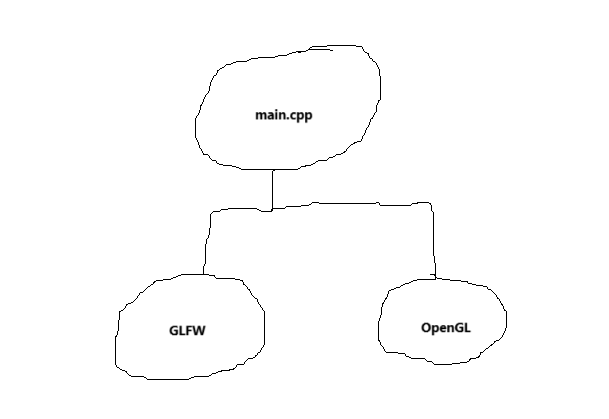
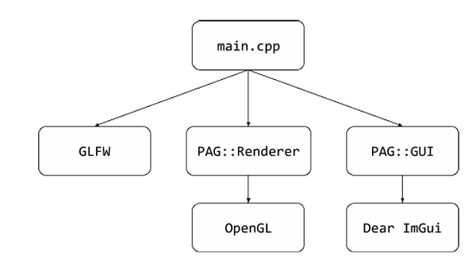

# pr-PAG
Para la segunda práctica, los cambios generales han sido la creación de las clases
PAG::Renderer y PAG::GUI, para el dibujo de la ventana de la aplicacion y su interfaz grafica de usuario respectivamente

Todo lo que tiene que ver con OpenGL se encuentra dentro de la clase Renderer, y todo lo que tiene que ver con la GUI esta en
la clase GUI.  Por eso en el "main.cpp" solo hay llamadas a estas clases.

Hemos pasado de esto:

A esto:

