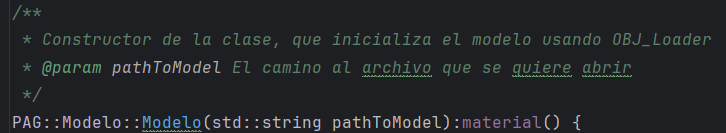

# Prácticas-PAG
### Autor: Adrián González Almansa
### Curso 24/25
## Práctica 3
He realizado bastantes cambios para implementar la practica 3, principalmente dentro de la clase Renderer.
Agregué toda la funcionalidad con los shader programs, como el vertex/fragment shader, el VAO del triangulo, y su VBO e IBO.
En UML ahora mismo la aplicación funciona así:

Tanto Renderer como GUI son Singletons, Renderer compila y ejecuta el shader program desde creaShaderProgram() y refrescar(), respectivamente.
GUI pinta la interfaz de usuario con el metodo refrescar(), y tiene los métodos setColor() y agregarMensajeLog(), para el dibujado de las ventanas de
ImGui.

Respecto a la cuestion planteada al final del 3er guión, del triangulo que se escala al tamaño de la ventana, esto ocurre ya que las coordenadas que damos en el VBO para la posicion
de cada vértice, son después de hacer la tranformación de proyección en el espacio normalizado. Las coordenadas de ese espacio hay que traducirlas al espacio de viewport (nuestra bonita ventana),
y esa traducción se hace siguiendo la siguiente formula:

Luego cuanto mayor sea la ventana de la aplicación mayor serán "w" y "h", por lo que mayor serán las coordenadas de cada punto, y por ello más grande será el triángulo.

## Práctica 4
Para esta práctica solo hemos tenido que desacoplar de la clase Renderer el funcionamiento del Shader Program,
y para ello he creado una clase llamada ShaderProgram que se encarga de ello. Incluye el funcionamiento del 
Vertex Shader y del Fragment Shader en su interior, pero en la siguiente práctica desacoplaré esto. El UML con la idea del proyecto actual es el siguiente:

## Práctica 5
Para esta práctica hemos tenido que implementar una camara virtual, que se puede mover con el ratón, teclado y con controles
de ImGui

He movido los archivos de shaders (tanto vertex como fragment) a una carpeta llamada "shader_files", por lo que para usar el programa "pag03" hay que hacer lo siguiente:

Una vez hecho lo anterior, he creado la clase PAG::Camara que alberga todo el funcionamiento de la camara, y esta clase se comunica con la clase ShaderProgram para 
poder hacer las transformaciones necesarias de visión y perspectiva, en el modelo que se va a dibujar. Desde los callbacks del main se comunica a la cámara de 
la aplicación el movimiento que ha de hacer (dolly, crane, ...), concretamente desde los callbacks para desplazamiento del raton, y para pulsar una tecla, que son
cursorPosition_callback() y key_callback() respectivamente.
Esto lo hago ya que así cuando ocurra un evento se notifica automaticamente a la cámara, que es como debe ser

La idea de comunicar los movimientos a la cámara directamente desde el main, lo veo lo más sencillo de entender y más simple posible

Para las ventanas de la aplicación, he creado una clase abstracta llamada "Ventana", y de esta heredan todas las ventanas que he creado con ImGui, siendo la última
la de gestion de movimiento de cámara, con un simple selector de tipo de movimiento, y botones para actualizarla:

La version actual en un diagrama de clases UML de la aplicación, es la siguiente:

## Práctica 6
Vamos a por esta práctica, que consiste en desacoplar del Shader Program el funcionamiento del modelo. Para ello, voy a empezar haciendo una clase PAG::Modelo
que contenga por supuesto, los datos como vertices, normales, y matriz de modelado que definen al modelo, pero en mi caso lo hace dentro de una clase auxiliar llamada
PAG::Malla, y por ahora un modelo solo tiene una malla, aunque esto se puede cambiar facilmente.

Para extraer los datos del modelo que queramos en nuestra app uso OBJ_Loader que los saca de archivos .obj. 
Esto lo hago dentro de la clase Modelo, y luego a la clase Malla se pasan estos datos extraidos, para
que cree el VAO que usará nuestro querido OpenGL para dibujar el modelo. Assimp me dio ciertos fallos leyendo .obj, por eso utilizo esta herramienta

Siguiendo la jerarquía de ventanas de ImGui en mi app, agrego dos ventanas nuevas:

La de la izquierda en la imagen es para elegir un modelo dentro de la carpeta "Modelos3D", y agregarlo al Shader Program, y la de la derecha
es para aplicar una transformacion como Traslación, Rotación o Escalado al modelo que seleccionemos de los activos
en escena

Para usar la aplicación, hemos de seguir los siguientes pasos:
1. En la ventana de shader program, escoger el shader que deseemos
2. Luego, seleccionamos un modelo a cargar en la ventana de selección de modelo
3. Ya podemos ver nuestro modelo!

Si queremos cargar otro modelo, no hay ningún problema, solo tenemos que repetir el paso 2.

La aplicación en funcionamiento se ve así:

Y el UML actual es el siguiente:

## Práctica 7

Para esta práctica he tenido que crear una clase Material, que contiene actualmente el color ambiente, difuso y especular del material, así como el exponente especular. Luego, también
hemos usado una subrutina GLSL, que con código C++ en la clase Shader Program se escoge su implementación, para así pintar el módelo actual con un color u otro.

El material ahora mismo se asigna por defecto en la creación del modelo, como se ve en el constructor de la clase PAG::Modelo:

El material tiene asignado unos atributos por defecto, los colores están en formato RGB :
- colorAmbiente = (0.1, 0.0, 0.0)
- colorDifuso = (1.0, 1.0, 1.0)
- colorEspecular = (1.0, 0.0, 1.0)
- exponenteEspecular = 100

Para próximas prácticas se podrán crear materiales distintos, y asignarlos a cada modelo de forma dinámica

La subrutina solo necesita este código en C++ , que actualmente está en la el método PAG::ShaderProgram::ejecutarSP()

El UML actual de la app es el siguiente:

